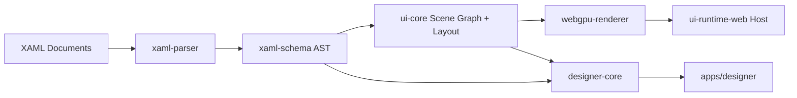
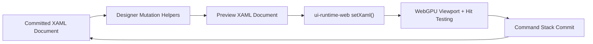

# Architecture

## Purpose

This project builds a XAML-inspired UI framework that renders with WebGPU, plus a visual designer on an infinite canvas.

The architecture is intentionally split so the runtime and designer can evolve independently while sharing a single UI model.

## Design Principles

1. XAML is the source of truth for structure and intent.
2. Runtime and designer share schema, parser contracts, and scene graph concepts.
3. Rendering is a backend concern; UI semantics do not depend on WebGPU internals.
4. Authoring workflows (selection, snapping, undo/redo) live outside runtime core.
5. Every subsystem should be testable without requiring browser rendering.

## System Overview

## Packages

### `packages/xaml-schema`
Defines the canonical data contracts for parsed XAML trees and control metadata.

Responsibilities:
- AST types
- primitive conversion rules
- control catalog and validation primitives

### `packages/xaml-parser`
Converts markup text into a typed AST.

Responsibilities:
- syntax parsing
- parser diagnostics
- attribute conversion into schema primitives

### `packages/ui-core`
Owns runtime-independent UI behavior.

Responsibilities:
- scene graph construction
- measure/arrange layout pipeline
- persisted authoring offsets via `Designer.OffsetX` and `Designer.OffsetY`
- hit-test and event routing contracts
- binding and invalidation entry points

### `packages/webgpu-renderer`
Implements render passes and draw orchestration.

Responsibilities:
- WebGPU setup and swapchain management
- draw-list execution
- clipping, ordering, and batching boundaries
- bitmap glyph atlas management for text
- textured quad rendering for text runs

### `packages/ui-runtime-web`
Browser host for runtime execution.

Responsibilities:
- canvas lifecycle
- resize loop and frame scheduling
- input and IME integration surface
- bootstrapping from XAML documents
- rebuilding the rendered tree from updated XAML without owning editor state

### `packages/designer-core`
Editor-domain logic for the visual design surface.

Responsibilities:
- world-space camera model (pan/zoom)
- selection state and transform handles
- snapping guides and command stack
- document parsing, cloning, tree inspection, targeted attribute updates, and structural node moves
- serialization hooks back to XAML

### `packages/designer-widgets`
Reusable UI-side data contracts for inspector and tooling panels.

Responsibilities:
- property section models
- toolbox descriptors
- outline and asset panel schemas

## App Layer

### `apps/playground`
Reference runtime host for quickly validating the framework behavior.

### `apps/designer`
Visual editor shell with infinite canvas viewport and authoring panels.

## Runtime Pipeline

1. Read XAML document text.
2. Parse text into `xaml-schema` AST.
3. Build a runtime scene graph in `ui-core`.
4. Execute layout pass (measure then arrange).
5. Generate draw commands for bounds, solid rects, and text runs.
6. Draw rect primitives and glyph-backed text quads via `webgpu-renderer`.
7. Route input events and schedule invalidation.

## Draw Command Model

`ui-core` now emits three command categories:

- `bounds`: invisible element boxes used for hit-testing, selection targeting, and post-layout transforms without depending on visible pixels
- `rect`: solid-color primitives for panels, borders, fills, and editor affordances
- `text`: styled text boxes that carry content, alignment, font metadata, and layout bounds through to the renderer

This split matters in the designer because a `TextBlock` can now participate in selection and resizing without rendering placeholder bars.

## Text Rendering MVP

The current text path is intentionally simple and practical:

1. `ui-core` measures `TextBlock` and `Button` label content with a shared 2D canvas context so default sizing is based on real font metrics rather than character-count heuristics.
2. Text content is emitted as `text` draw commands with a layout box, font metadata, wrapping, and overflow behavior.
3. `webgpu-renderer` lazily rasterizes glyphs into a bitmap atlas on a hidden 2D canvas.
4. The atlas is uploaded to a GPU texture when new glyphs appear.
5. Text commands are expanded into clipped textured quads in screen space and composited in a second render pass with alpha blending.

Current MVP constraints:

- text shaping is per-codepoint, not HarfBuzz-class shaping
- wrapping is greedy and whitespace-aware rather than full paragraph layout
- ellipsis is line-based and not typographically aware
- atlas eviction is not implemented yet

## Designer Pipeline

1. Load or create XAML document.
2. Parse into a working XAML AST plus a base document snapshot.
3. Materialize the scene graph for preview rendering.
4. Project scene into world coordinates.
5. Render viewport content plus editor overlays (selection, handles, grid).
6. Build transient preview documents during drag and resize interactions.
7. Commit inspector, tree, and source edits through undoable document commands where applicable.
8. Allow direct source editing with parse/apply validation for document-level changes.
9. Insert richer template nodes from a designer palette with container-aware placement rules.
10. Reorder and reparent document nodes through tree drag/drop and structural commands.
11. Serialize the committed document back to XAML and persist local drafts or export files.

## Designer Document Model

The designer is now document-backed rather than override-backed.

Key concepts:
- Base document: the loaded or opened XAML document used as the reset target for element-level edits.
- Working document: the committed in-memory XAML AST that represents the current designer state.
- Preview document: a temporary AST generated during pointer interactions so drag and resize can feel live without polluting undo history.
- Runtime host: used as the renderer and hit-test surface only. It receives XAML strings from the designer and does not own authoritative edit state.
- Tree actions: structural edits such as create, delete, and reparent that operate on AST structure and then reselect the moved node by its new document path.
- Palette templates: richer starter nodes that can expand into nested XAML subtrees rather than only single controls.
- File interchange: the designer can now import and export XAML files in addition to local draft persistence.

Persisted editable attributes:
- `Designer.OffsetX` and `Designer.OffsetY` store freeform movement independently of container layout rules.
- `Width` and `Height` store explicit sizing changes.
- `Background` or `Fill` store visual color edits depending on the control type.

Reset behavior:
- Reset actions compare the working document against the base document for the selected node.
- Editable attributes are restored from the base document, which makes reset deterministic even after multiple undo/redo cycles.
- Applying raw XAML source replaces the working and base documents together, because source edits redefine the current authoring baseline.
- Importing a XAML file also replaces the working and base documents together, so the imported file becomes the new reset and undo baseline.

## Current MVP Editing Loop

## Non-Goals for MVP

1. Full WPF/XAML parity.
2. Complete accessibility implementation.
3. Advanced text shaping and international script support.
4. Production-grade style/template engine.

## Evolution Notes

The final architecture supports adding alternative render backends (Canvas2D, WebGL, software) by keeping `ui-core` and markup contracts independent from WebGPU-specific code.
