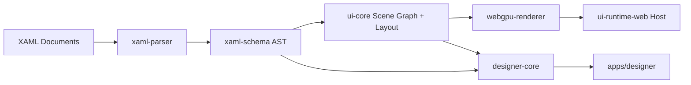

# Architecture

## Purpose

This project builds a XAML-inspired UI framework that renders with WebGPU, plus a visual designer on an infinite canvas.

The architecture is intentionally split so the runtime and designer can evolve independently while sharing a single UI model.

## Design Principles

1. XAML is the source of truth for structure and intent.
2. Runtime and designer share schema, parser contracts, and scene graph concepts.
3. Rendering is a backend concern; UI semantics do not depend on WebGPU internals.
4. Authoring workflows (selection, snapping, undo/redo) live outside runtime core.
5. Every subsystem should be testable without requiring browser rendering.

## System Overview

## Packages

### `packages/xaml-schema`
Defines the canonical data contracts for parsed XAML trees and control metadata.

Responsibilities:
- AST types
- primitive conversion rules
- control catalog and validation primitives

### `packages/xaml-parser`
Converts markup text into a typed AST.

Responsibilities:
- syntax parsing
- parser diagnostics
- attribute conversion into schema primitives

### `packages/ui-core`
Owns runtime-independent UI behavior.

Responsibilities:
- scene graph construction
- measure/arrange layout pipeline
- hit-test and event routing contracts
- binding and invalidation entry points

### `packages/webgpu-renderer`
Implements render passes and draw orchestration.

Responsibilities:
- WebGPU setup and swapchain management
- draw-list execution
- clipping, ordering, and batching boundaries
- eventual text and image atlas paths

### `packages/ui-runtime-web`
Browser host for runtime execution.

Responsibilities:
- canvas lifecycle
- resize loop and frame scheduling
- input and IME integration surface
- bootstrapping from XAML documents

### `packages/designer-core`
Editor-domain logic for the visual design surface.

Responsibilities:
- world-space camera model (pan/zoom)
- selection state and transform handles
- snapping guides and command stack
- serialization hooks back to XAML

### `packages/designer-widgets`
Reusable UI-side data contracts for inspector and tooling panels.

Responsibilities:
- property section models
- toolbox descriptors
- outline and asset panel schemas

## App Layer

### `apps/playground`
Reference runtime host for quickly validating the framework behavior.

### `apps/designer`
Visual editor shell with infinite canvas viewport and authoring panels.

## Runtime Pipeline

1. Read XAML document text.
2. Parse text into `xaml-schema` AST.
3. Build a runtime scene graph in `ui-core`.
4. Execute layout pass (measure then arrange).
5. Generate render commands.
6. Draw via `webgpu-renderer`.
7. Route input events and schedule invalidation.

## Designer Pipeline

1. Load or create XAML document.
2. Parse and materialize the scene graph.
3. Project scene into world coordinates.
4. Render viewport (content pass) and editor overlays (handles, guides).
5. Apply command-based edits.
6. Serialize updates back to XAML.

## Non-Goals for MVP

1. Full WPF/XAML parity.
2. Complete accessibility implementation.
3. Advanced text shaping and international script support.
4. Production-grade style/template engine.

## Evolution Notes

The final architecture supports adding alternative render backends (Canvas2D, WebGL, software) by keeping `ui-core` and markup contracts independent from WebGPU-specific code.
